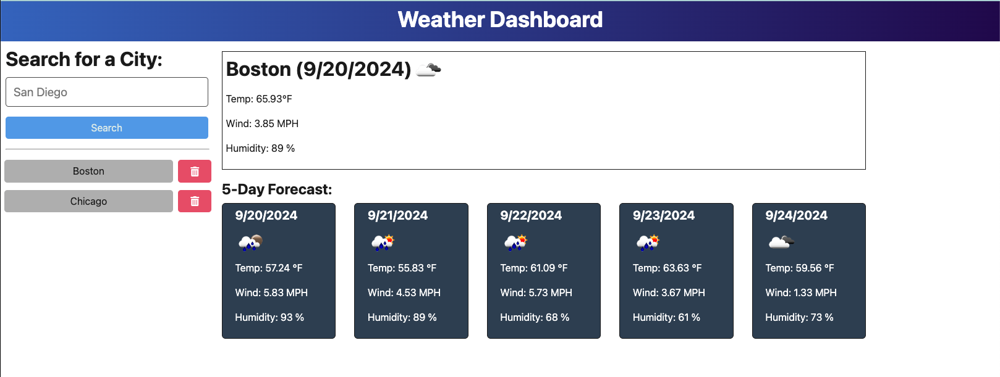

# weatherDashboard

## Description

This project was to create a Weather Dashboard application that allows the user to enter a city and have the website return both the current weather for that city and the five day forecast for the city. Included in the weather data is the date, temperture, a description of the weather, a weather icon, the humidity and wind speed. 

This project used the external web API, Open Weather API to collect all of the weather data. 

## Screenshot of Application

## Link to Deployed Application

https://weatherdashboard-l662.onrender.com/
## Contributors
Used Xpert Learning Assistant for help with this assignment.